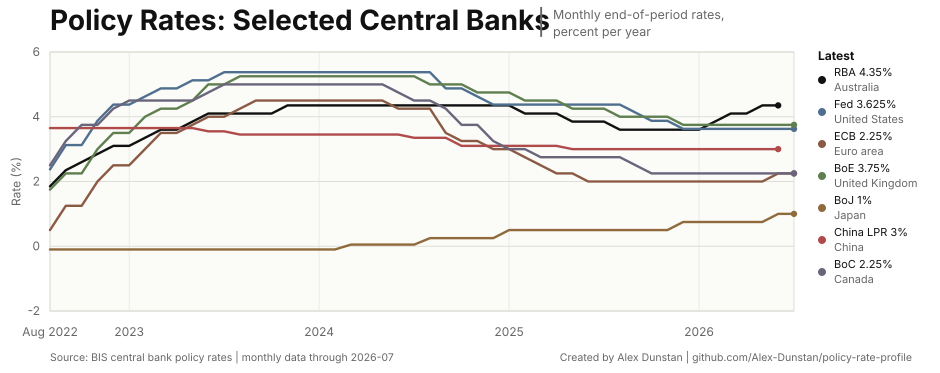

# Policy Rate Profile

Auto-generated central-bank policy-rate chart for a GitHub profile or project README.

The generator pulls BIS central bank policy rates, keeps a compact cache, renders a profile-ready SVG, and builds a local preview page with multiple themes.

<p align="center">
  
</p>

## Quick Start

```sh
git clone https://github.com/OWNER/policy-rate-profile.git
cd policy-rate-profile
make generate
open preview/policy-rates.html
```

No Python packages are required.

## Preview

Open:

```sh
make preview
```

Main generated chart:

```md

```

## Generate

```sh
make generate
```

Theme override:

```sh
python3 scripts/policy_profile.py --theme terminal
```

Use cached data:

```sh
python3 scripts/policy_profile.py --offline
```

List themes:

```sh
make themes
```

Check generated outputs:

```sh
make check
```

## Data

Source: BIS central bank policy rates bulk CSV.

Default series: RBA, Fed, ECB, BoE, BoJ, China LPR, BoC.

Default window: 48 monthly observations.

China uses the BIS China 1-year loan prime rate series, so it is labelled `China LPR` rather than `PBoC`.

## Theme Control

Edit `policy-profile.config.json`.

Current themes: `editorial`, `print`, `terminal`.

Default profile output theme:

```json
"selected_theme": "editorial"
```

Attribution footer:

```json
"credit": {
  "name": "Alex Dunstan",
  "profile": "github.com/Alex-Dunstan/policy-rate-profile",
  "url": "https://github.com/Alex-Dunstan/policy-rate-profile"
}
```

## Automation

`.github/workflows/update-policy-profile.yml` refreshes the SVG every Thursday and can also run manually with `workflow_dispatch`.

The workflow commits generated assets when BIS data changes.

## Use In Another README

If this repo is public, embed the raw SVG:

```md
<p align="center">
  <a href="https://github.com/OWNER/policy-rate-profile">
    
  </a>
</p>
```

More detail: `docs/github-profile-embed.md`, `docs/configuration.md`.
